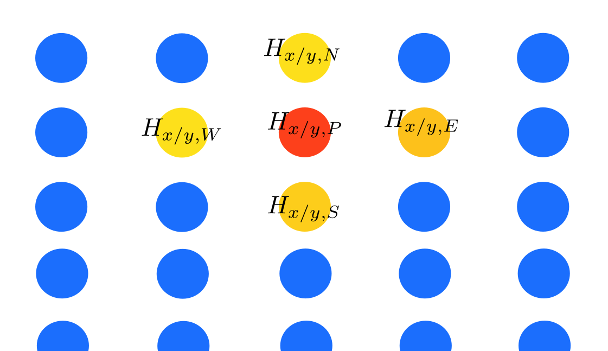
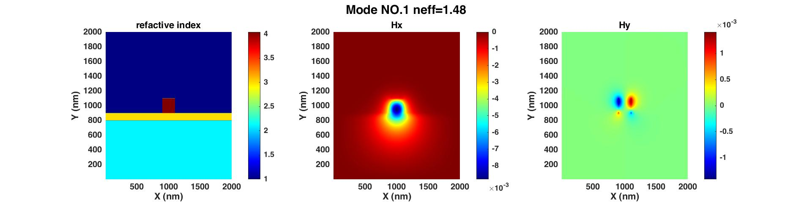
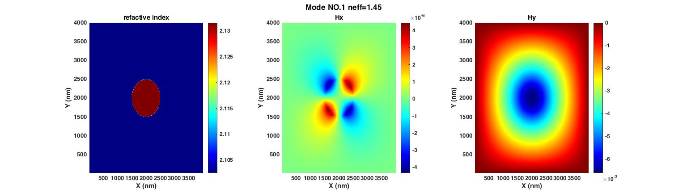

# FDFD method for waveguide mode analysis
## Introduction of the program

This program simulates the mode of waveguides and the material could be anisotropic:
$$
\varepsilon = \left[\begin{matrix}
&\varepsilon_{xx} & 0     & 0  \\
& 0         & \varepsilon_{yy}   &0 \\
& 0        & 0 &\varepsilon_{zz}
\end{matrix}
\right]
$$

## Theoretical formulation

We begin from the Maxwell equations
$$
\nabla \times H =i \times \omega [ \varepsilon]E
$$

$$
\nabla \times E=-j \omega \mu H
$$

$$
\nabla \cdot B = 0
$$

$$
\nabla \cdot [\varepsilon]E =0
$$

for waveguide modes, we set $H(x,y,z)=H(x,y)e^{-i\beta z}$， and we can obtain the equations of $H_{x},H_{y}$

$$
\frac{\partial^2 h_{x}}{\partial x^2}+\frac{\varepsilon_y}{\varepsilon_z} \frac{\partial^2 h_{x}}{\partial y^2}+(1-\frac{\varepsilon_y}{\varepsilon_z})\frac{\partial^2 h_{y}}{\partial x \partial y}+k^2 \varepsilon_{x} h_{x}^{2}=\beta^{2}h_{x}
$$

$$
\frac{\partial^2 h_{y}}{\partial y^2}+\frac{\varepsilon_x}{\varepsilon_z} \frac{\partial^2 h_{y}}{\partial x^2}+(1-\frac{\varepsilon_x}{\varepsilon_z})\frac{\partial^2 h_{x}}{\partial x \partial y}+k^2 \varepsilon_{y} h_{y}^{2}=\beta^{2}h_{y}
$$

after derivations, the final five-point equations to be used in program should be

$$
H_{xW}+H_{xE}+\frac{d_{x}}{d_{y}}\left( \frac{\frac{1}{\epsilon_{1z}}}{\frac{1}{\epsilon_{1y}+\frac{1}{\epsilon{2y}}}} +\frac{\frac{1}{\epsilon_{4z}}}{\frac{1}{\epsilon_{4y}+\frac{1}{\epsilon{3y}}}}\right)H_{xN}+
\frac{d_{x}}{d_{y}}\left( \frac{\frac{1}{\epsilon_{2z}}}{\frac{1}{\epsilon_{1y}+\frac{1}{\epsilon{2y}}}}+
\frac{\frac{1}{\epsilon_{3z}}}{\frac{1}{\epsilon_{4y}+\frac{1}{\epsilon{3y}}}} \right)H_{xS}+
$$

$$
\left( \frac{k^2}{\frac{1}{\epsilon_{4y}}+\frac{1}{\epsilon{3y}}}(d_{x})^2 -2+\frac{k^2}{\frac{1}{\epsilon_{1y}}+\frac{1}{\epsilon_{2y}}}(d_{x})^2-
\frac{\frac{1}{\epsilon_{3z}}+\frac{1}{\epsilon_{4z}}}{\frac{1}{\epsilon_{4y}}+\frac{1}{\epsilon_{3y}}} \left(\frac{{d_{x}}^2}{{d_{y}}^2}\right)-
\frac{\frac{1}{\epsilon_{2z}}+\frac{1}{\epsilon_{1z}}}{\frac{1}{\epsilon_{2y}}+\frac{1}{\epsilon_{1y}}} \left(\frac{{d_{x}}^2}{{d_{y}}^2}\right) \right) H_{xP}
$$

$$
\frac{d_{x}}{2d_{y}}\left(\frac{\frac{1}{\epsilon_{4z}}-\frac{1}{\epsilon_{3z}}}{\frac{1}{\epsilon_{4y}}+\frac{1}{\epsilon_{3y}}}-\frac{\frac{1}{\epsilon_{2y}}-\frac{1}{\epsilon_{1y}}}{\frac{1}{\epsilon_{1y}}+\frac{1}{\epsilon_{2y}}}\right)H_{yW}+
\frac{d_{x}}{2d_{y}}\left(\frac{\frac{1}{\epsilon_{2z}}-\frac{1}{\epsilon_{1z}}}{\frac{1}{\epsilon_{1y}}+\frac{1}{\epsilon_{2y}}}-\frac{\frac{1}{\epsilon_{4y}}-\frac{1}{\epsilon_{3y}}}{\frac{1}{\epsilon_{3y}}+\frac{1}{\epsilon_{4y}}}\right)H_{yE}=\beta^2(d_{x})^2H_{xP}
$$

$$
H_{yN}+H_{yS}+\frac{d_{y}}{d_{x}}\left( \frac{\frac{1}{\epsilon_{1z}}}{\frac{1}{\epsilon_{1x}+\frac{1}{\epsilon{4x}}}} +\frac{\frac{1}{\epsilon_{2z}}}{\frac{1}{\epsilon_{2x}+\frac{1}{\epsilon{3x}}}}\right)H_{yE}+
\frac{d_{y}}{d_{x}}\left( \frac{\frac{1}{\epsilon_{4z}}}{\frac{1}{\epsilon_{1x}+\frac{1}{\epsilon{4x}}}}+
\frac{\frac{1}{\epsilon_{3z}}}{\frac{1}{\epsilon_{2x}+\frac{1}{\epsilon{3x}}}} \right)H_{yW}+
$$

$$
\left( \frac{k^2}{\frac{1}{\epsilon_{4x}}+\frac{1}{\epsilon{1x}}}(d_{y})^2 -2+\frac{k^2}{\frac{1}{\epsilon_{3x}}+\frac{1}{\epsilon_{2x}}}(d_{y})^2-
\frac{\frac{1}{\epsilon_{1z}}+\frac{1}{\epsilon_{4z}}}{\frac{1}{\epsilon_{4x}}+\frac{1}{\epsilon_{1x}}} \left(\frac{{d_{y}}^2}{{d_{x}}^2}\right)-
\frac{\frac{1}{\epsilon_{2z}}+\frac{1}{\epsilon_{3z}}}{\frac{1}{\epsilon_{2x}}+\frac{1}{\epsilon_{3x}}} \left(\frac{{d_{y}}^2}{{d_{x}}^2}\right) \right) H_{yP}
$$

$$
\frac{d_{x}}{2d_{y}}\left(\frac{\frac{1}{\epsilon_{2z}}-\frac{1}{\epsilon_{3z}}}{\frac{1}{\epsilon_{2x}}+\frac{1}{\epsilon_{3x}}}-\frac{\frac{1}{\epsilon_{4x}}-\frac{1}{\epsilon_{1x}}}{\frac{1}{\epsilon_{1x}}+\frac{1}{\epsilon_{4x}}}\right)H_{xN}+
\frac{d_{x}}{2d_{y}}\left(\frac{\frac{1}{\epsilon_{4z}}-\frac{1}{\epsilon_{1z}}}{\frac{1}{\epsilon_{1x}}+\frac{1}{\epsilon_{4x}}}-\frac{\frac{1}{\epsilon_{2x}}-\frac{1}{\epsilon_{3x}}}{\frac{1}{\epsilon_{3x}}+\frac{1}{\epsilon_{2x}}}\right)H_{xS}=\beta^2(d_{y})^2H_{yP}
$$

and the position of $H_{x/y,N/S/W/E}$ in the grid point is as follows 

the final eigenvalue equations could be written as
$$
\textbf{M} \left [\begin{matrix}H_{x}\\ H_{y}\end{matrix}\right]=\beta^2   \left [\begin{matrix}H_{x}\\ H_{y}\end{matrix}\right]
$$

## Simple example

### Rectangle waveguide on chip

The program `WaveguideSet_RectGuide` defines general on-chip waveguide structures and the waveguide modes can be simulated 

### Step index fiber

The program `WaveguideSet_StepIndexFiber` defines general step index fiber structures and the waveguide modes can be simulated 

